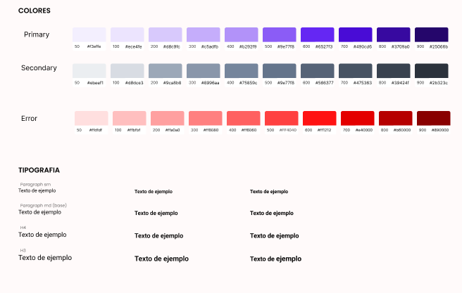
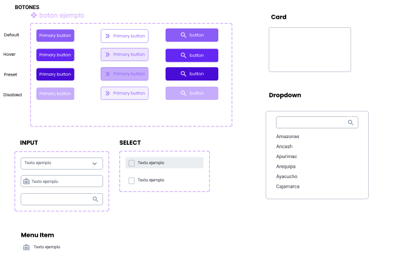
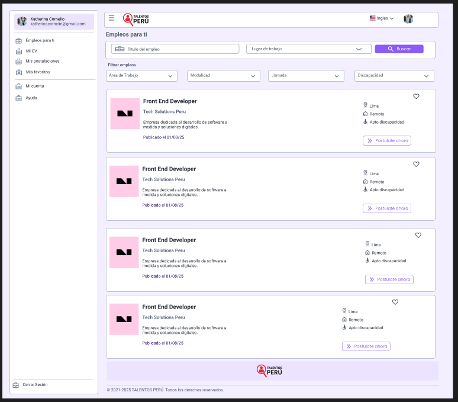
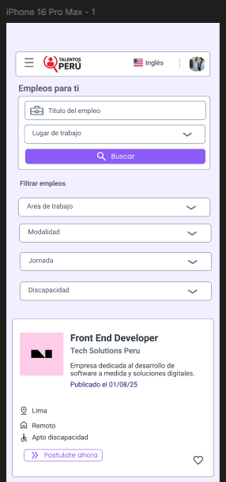

# 🌟 App Talentos Perú

Proyecto desarrollado por **Katherina Marilu Cornelio**  
🔗 **Demo publicada:** [Enlace a la aplicación](https://app-talentos-peru.netlify.app/)  
🎨 **Prototipo Figma Desktop:** [Ver en Figma](https://www.figma.com/proto/0iQnhaVxOVcNuloOLEyAJN/Talentos-Peru?node-id=46-149&t=Ris1lE3qGowsCrlZ-1&scaling=scale-down&content-scaling=fixed&page-id=46%3A148&starting-point-node-id=46%3A149)  
📱 **Prototipo Figma Mobile:** [Ver en Figma](https://www.figma.com/proto/0iQnhaVxOVcNuloOLEyAJN/Talentos-Peru?node-id=60-292&p=f&t=lAiGoPANodDeDHfG-1&scaling=scale-down&content-scaling=fixed&page-id=60%3A291&starting-point-node-id=60%3A292)

---

## 📌 Caso

**Talentos Perú** es una aplicación que permite a los postulantes visualizar ofertas de trabajo en un formato sencillo y atractivo.  
La app integra búsqueda, filtros y soporte para dos idiomas (español/inglés), ofreciendo una experiencia amigable tanto en **desktop** como en **móvil**.

Funcionalidades principales:

- Encabezado con logo, botón de perfil e idioma.
- Buscador de empleos por palabra clave.
- Filtros por ubicación, modalidad y área laboral.
- Listado de ofertas en tarjetas visuales.
- Botón “Postular” en cada oferta.
- Diseño responsive.

---

## 🎯 UX / UI

### Historias de Usuario

🔹 **1. Buscar ofertas por palabra clave**

- El usuario puede ingresar un término en la barra de búsqueda.
- El sistema filtra en tiempo real o al presionar "Buscar".
- Si no hay resultados: mensaje “No se encontraron ofertas”.

🔹 **2. Ver las ofertas en tarjetas visuales**

- Cada oferta se presenta en una tarjeta con título, empresa, ubicación, modalidad y botón "Postular".
- Diseño responsivo: múltiples tarjetas por fila en desktop y una por fila en móvil.

🔹 **3. Filtrar por ubicación**

- Dropdown con lista de departamentos del Perú.
- Se muestran solo las ofertas en la ubicación seleccionada.
- Puede combinarse con modalidad y palabra clave.

🔹 **4. Filtrar por modalidad de trabajo**

- Opción de elegir entre remoto, presencial o híbrido.
- El sistema muestra solo esas ofertas.
- Filtro combinable con otros.

🔹 **5. Filtrar por área laboral**

- Dropdown con áreas como Tecnología, Marketing, Ventas, etc.
- Se muestran solo las ofertas del área seleccionada.
- Filtros combinables.

🔹 **6. Cambiar idioma**

- El navbar incluye un switch/drowpdown para cambiar entre español e inglés.
- La interfaz se actualiza dinámicamente al cambiar idioma.
- El idioma seleccionado se mantiene durante la navegación.

---

## 🎨 Figma

- **Sistema de diseño:** basado en **Atomic Design** (átomos, moléculas, organismos, plantillas y páginas).
- Incluye tipografías, colores, espaciados y componentes reutilizables.  
  🔗 **Sistema de Diseño en Figma:** [Ver aquí](https://www.figma.com/design/0iQnhaVxOVcNuloOLEyAJN/Talentos-Peru?node-id=1-2&t=d7FP2RtaxtSqafI9-1)

  ### 📸 Screenshots de Figma

A continuación se muestran capturas de las pantallas principales diseñadas en Figma:

  
_Colores y tipografia_

  
_Componentes_

  
_Prototipo desktop_

  
_Prototipo Mobile_

---

## ⚙️ Frontend

La aplicación está construida con **Angular**:

- **Servicios (Services):** para manejar la comunicación con el backend simulado.
- **Pipes personalizados:** para transformar valores (ejemplo: mostrar nombre del departamento desde su código).
- **RxJS:** para manejo de asincronía y flujos reactivos.
- **Signals:** para el manejo de estado de la aplicación.
- **PrimeNG & Tailwind:** para componentes y estilos.

### ✅ Funcionalidades implementadas

- Navbar con logo, perfil e idioma.
- Buscador y listado de empleos.
- Tarjetas de ofertas con detalles y botón “Postular”.
- Soporte multiidioma.
- Diseño responsive (desktop y móvil).

### ⏳ Funcionalidades pendientes

- [ ] Implementar filtrado completo (ubicación, modalidad, área laboral).

---

## 🗄️ Backend

- Simulado con JSON Server.
- El backend expone endpoints REST para obtener las ofertas de trabajo.  
  🔗 **JSON Server en línea:** [Ver API](https://talentos-peru-mock-server.onrender.com/jobs)

Ejemplo de endpoint:

```bash
GET /jobs
```

## ✍️ Autor

Diseño/programacion realizado por: **Katherina Marilú Cornelio Zarate**
